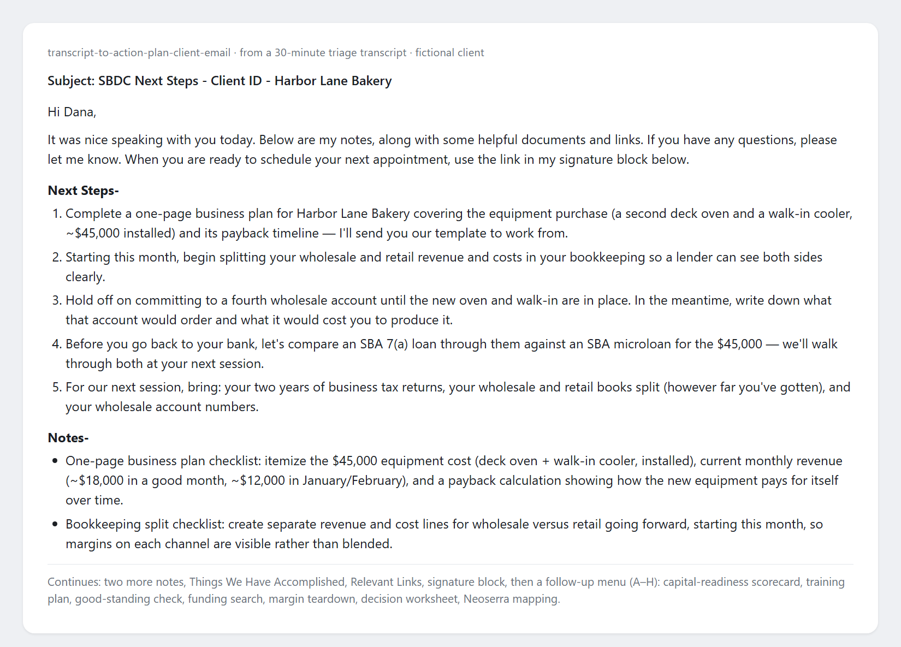

# Turn a client meeting into the follow-up email and the file note, plus twelve more advising jobs, in the chat you already use.



## Use it where you already work

One guide per skill, what to have ready and what comes back: https://bwfnx.github.io/sbdc-toolkit/

### ChatGPT
Skills replace custom GPTs (OpenAI is retiring GPTs on Enterprise workspaces **December 11, 2026**). Two ways in:

1. **Install from GitHub** — switch the chat to **Work mode** (a regular chat can't install from GitHub), then paste:
   ```
   install https://github.com/bwfnx/sbdc-toolkit
   ```
2. **Upload the zip** — if your workspace blocks the GitHub install, download this repo as a ZIP (green **Code** button → Download ZIP) and upload it at [chatgpt.com/skills](https://chatgpt.com/skills).

Plugins/Skills rolled out on Business and Enterprise workspaces on 22 Sep 2026; they were not yet available on personal/Plus accounts at that time. On an account without them, fall back to copying a single skill file — open any `skills/<name>/SKILL.md`, copy the whole file, and paste it into a **Project**'s instructions or a custom GPT. One skill per Project.

Skills live in your own ChatGPT account — no hosting to pay for or maintain.

### Claude desktop app
Download `sbdc-toolkit.plugin` from the [latest release](https://github.com/bwfnx/sbdc-toolkit/releases/latest), drag it into a chat, click **Accept**. No GitHub account needed.

### Claude Code

```
/plugin marketplace add https://github.com/bwfnx/sbdc-toolkit.git
```
```
/plugin install sbdc-toolkit@maryland-sbdc
```

The repo is public, so no authentication is required.

### Anything else
Copy the skill text into whatever system prompt, project instruction, or agent config your assistant uses. There is nothing vendor-specific inside the files.

## What this is

15 skills for SBDC advising work — turning client meetings into follow-up emails and file notes, coaching on capital and debt, drafting grants and government proposals, building business-model and market-sizing analyses, and producing marketing plans, success stories, referrals, training newsletters, and full workshop packages (deck, worksheet, follow-up email). Written for Maryland SBDC practice, in Brandon Mason's consulting voice, mapped to Neoserra milestones and fields.

**A skill here is a plain Markdown file, not an app.** Each one is instructions an assistant reads and follows, so the same file works in ChatGPT, the Claude desktop app, Claude Code — and anything else that accepts custom instructions. Pick whichever you already pay for; the outputs are the same.

**Migrating off custom GPTs?** That is exactly what these are. OpenAI is retiring GPTs on Enterprise workspaces on **December 11, 2026**; each skill here is already in the SKILL.md shape that replaces them, so you can install the set rather than rebuild 15 GPTs by hand.

**[How to actually use each skill →](https://bwfnx.github.io/sbdc-toolkit/)** — one guide per skill: what to have ready, what to say, what comes back, and what it will never do.

Other SBDCs are welcome to use and adapt these (MIT). They encode Maryland practice, so check anything touching your own CRM, programs, or reporting rules before you rely on it.

### Adapting for your state

These are the Maryland-specific parts. Swap them for your own and the rest works anywhere.

| Maryland-specific | Swap in | Where it appears |
|---|---|---|
| **Neoserra** CRM, its milestone list, and the Nexus / EDMIS counseling narrative | Your CRM's milestone categories and session-note rules | `transcript-to-action-plan-client-email` (milestone list, `references/milestone-mapping-reference.md`), `transcript-to-meeting-notes`, `transcript-to-sop`, `client-follow-up-and-reengagement`, `sbdc-success-story`, `sbdc-training-newsletter`, `business-service-provider-referral-engine` |
| **SDAT / Maryland Business Express** good-standing link | Your Secretary of State business entity search | `transcript-to-action-plan-client-email` |
| **Maryland Community Business Compass** funding search | Your state's program directory, or remove the line | `transcript-to-action-plan-client-email` |
| **Maryland MBE and MDOT** certifications | Your state's certification programs | `transcript-to-action-plan-client-email`, `transcript-to-meeting-notes`, `client-follow-up-and-reengagement` |
| **TEDCO, DHCD, Maryland Commerce** grant programs | Your state's economic development programs | `sbdc-grant-advisor`, `sbdc-success-story` |
| **Maryland SBDC deck design, logo, sign-up link, and county list** | Your brand colors, logo file, registration link, and service area | `sbdc-workshops` (`scripts/deck/engine.py`, `scripts/apps-script/form_builder.gs`) |
| **"Maryland SBDC"** name, signature, and funding acknowledgment | Your center's name and required acknowledgment | `sbdc-grant-advisor`, `sbdc-success-story`, `sbdc-training-newsletter`, `business-service-provider-referral-engine`, `proposal-buddy` |

Ready to use as-is: `business-model-canvas-helper`, `mdsbdc-debt-helper`, `sbdc-underwriter-and-capital-coach`, `tam-sam-som`. `sbdc-marketing-plan-generator` has one Maryland mention.

Quick check after you adapt: search the `skills/` folder for "Maryland", "Neoserra", "SDAT", and "TEDCO". Anything left is something you haven't swapped yet.

## Update

Claude Code: `/plugin marketplace update maryland-sbdc`. Desktop app: download the newer `.plugin` from the [latest release](https://github.com/bwfnx/sbdc-toolkit/releases/latest) and Accept again. ChatGPT: re-paste the changed skill file.

## The 15 skills

| Skill | What it does |
|---|---|
| `transcript-to-action-plan-client-email` | Turns a meeting transcript into the client-facing follow-up email you post into Neoserra (Next Steps, Notes, Accomplishments, Links); flags milestones. |
| `transcript-to-meeting-notes` | Turns a transcript into your internal file record (Action Items, Milestones, Discussion Points, Resources). |
| `transcript-to-sop` | Turns a walkthrough or transcript into a reusable standard operating procedure. |
| `client-follow-up-and-reengagement` | Writes a warm re-engagement email to a client who has gone quiet, from their record alone. |
| `sbdc-underwriter-and-capital-coach` | Reviews a business plan or financials for lending feasibility like an SBA underwriter; risk-and-mitigation analysis and capital-readiness coaching. |
| `mdsbdc-debt-helper` | Guides a debt-workout / creditor-negotiation conversation. |
| `sbdc-grant-advisor` | Helps identify and pursue grant opportunities. |
| `business-model-canvas-helper` | Builds or interprets a Business Model Canvas block by block. |
| `tam-sam-som` | Sizes a market — total addressable, serviceable, and obtainable. |
| `sbdc-marketing-plan-generator` | Produces a structured marketing plan for a client. |
| `proposal-buddy` | Government proposal assistant on the Shipley Model — RFP analysis, bid/no-bid, capture, compliance matrix, writing, review. |
| `sbdc-success-story` | Crafts success stories, press releases, legislative letters, and social posts from client wins. |
| `business-service-provider-referral-engine` | Matches clients to the right service providers and partners. |
| `sbdc-training-newsletter` | Drafts training and workshop newsletters. |
| `sbdc-workshops` | Rebuilds an old class deck into a click-by-click HTML deck, a QR-linked Google Form worksheet, an automatic follow-up email with each attendee's answers, a PDF, and a run sheet. |

## Notes

The guides in [`docs/`](docs/) are generated; they are published at <https://bwfnx.github.io/sbdc-toolkit/>.

This public toolkit intentionally excludes the internal `sbdc-second-brain` knowledge skill, which bundles private SBDC wiki material and is distributed separately.

## License

MIT — see [LICENSE](LICENSE).
